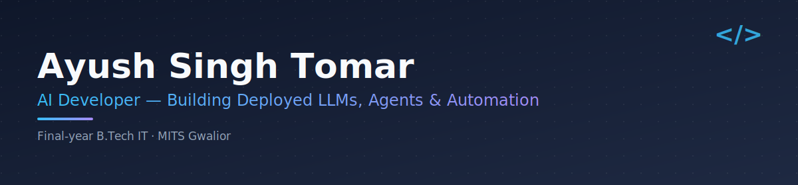

# Hi, I'm Ayush 👋

Final-year B.Tech IT student at MITS Gwalior, building AI projects that go beyond wrappers — deployed, real-world tools using LLMs, agents, and automation.

🎓 B.Tech IT, MITS Gwalior (Final Year)
🔭 Currently exploring multi-agent systems and RAG pipelines
💼 Open to AI/Backend internships and freelance work
📫 Reach me at [LinkedIn](https://linkedin.com/in/ayushsinghtomar)

---

## 🤖 Projects

### ⭐ [AgentLoop](https://github.com/ayush-s-tomar/agentloop) — [Live Demo](https://agentloop.onrender.com)
Multi-step research agent with tool-use and memory. Plans sub-questions, calls live web search, reflects on gaps, loops back, then writes a sourced report.
`FastAPI` `LangGraph` `Groq` `Tavily`

### ⭐ [ARIA – Voice AI Assistant](https://github.com/ayush-s-tomar/aria-voice-assistant) — [Live Demo](https://ayush-s-tomar.github.io/aria-voice-assistant)
Speech-to-speech AI assistant with 99-language support and conversation memory. Speak in any language — ARIA transcribes, thinks, and talks back.
`FastAPI` `Faster-Whisper` `Groq LLaMA` `gTTS`

### [AskMyDocs](https://github.com/ayush-s-tomar/intellect-docs-ai) — [Live Demo](https://intellect-docs-ai.vercel.app)
RAG-based document Q&A tool. Upload PDFs, ask questions, get cited answers with cosine similarity scores.
`Next.js` `Supabase pgvector` `Cohere`

### [Email Agent](https://github.com/ayush-s-tomar/Email-agent) — [Live Demo](https://email-agent-xi-drab.vercel.app)
AI agent that reads Gmail, classifies emails, drafts context-aware replies, and lets you approve or edit before sending.
`FastAPI` `React` `LLaMA 3.3`

### [StartupScope](https://github.com/ayush-s-tomar/startupscope) — [Live Demo](https://startupscope-ephq.onrender.com)
Multi-agent startup intelligence tool. A CrewAI crew of Researcher, Analyst, and Writer agents that searches the web and generates structured startup reports.
`CrewAI` `Groq` `SerperDev`

### [ResumeIQ](https://github.com/ayush-s-tomar/ResumeIQ) — [Live Demo](https://resumeiq-55h8.onrender.com)
AI resume screener that scores ATS compatibility, identifies gaps, and exports detailed PDF reports.
`Python` `Flask` `Groq`

### [n8n Email → Slack](https://github.com/ayush-s-tomar/n8n-email-slack) — [Live Demo](https://ayush22.app.n8n.cloud)
No-code AI automation pipeline: fetches unread Gmail → summarizes with Groq LLaMA → detects priority → pushes digest to Slack.
`n8n` `Groq` `Gmail` `Slack`

### [AI Data Analyst Agent](https://github.com/ayush-s-tomar/ai-data-analyst) — [Live Demo](https://ai-data-analyst-six-sooty.vercel.app)
Upload any CSV, ask questions in plain English, get instant charts and insights — powered by Groq's free Llama 3.3 70B.
`FastAPI` `React` `Groq` `pandas` `matplotlib`

---

## 🛠 Stack

---

## 📬 Connect

