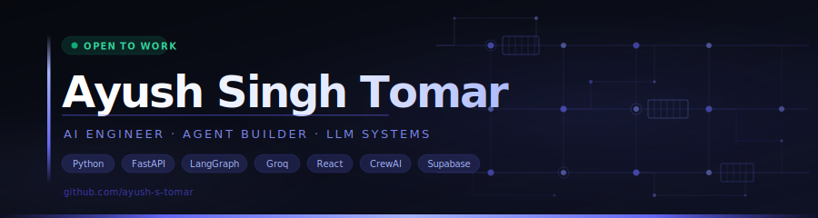

 

---

## 👨‍💻 About Me

Final-year B.Tech IT student at MITS Gwalior, building AI projects that go beyond wrappers — deployed, real-world tools using LLMs, agents, and automation.

- 🎓 B.Tech IT, MITS Gwalior (Final Year)
- 🔭 Specialising in multi-agent systems & RAG pipelines
- 🤖 10 deployed AI projects — each solving a real problem
- 💼 Open to AI Developer roles & freelance contracts
- ⚡ Stack: Groq · LangGraph · FastAPI · React · Supabase · CrewAI

---

## 🤖 Projects

> ★ Start here: **SalesAgent · AgentLoop · AskMyDocs · AI Data Analyst**

**[SalesAgent](https://github.com/ayush-s-tomar/salesagent)** — [Live Demo](https://salesagent-theta.vercel.app) | [📝 Writeup](https://dev.to/ayushsinghtomar/i-got-tired-of-writing-cold-emails-so-i-built-an-ai-agent-to-do-it-for-me-2m4h)
Autonomous B2B sales agent. Paste a LinkedIn URL — it researches the lead, scores them with ML (84/100), and drafts a hyper-personalized cold email referencing real company events. In 45 seconds.
`LangGraph` `FastAPI` `React` `scikit-learn` `Groq` `Tavily`

**[AgentLoop](https://github.com/ayush-s-tomar/agentloop)** — [Live Demo](https://agentloop.onrender.com)
Not a chatbot. A multi-step research agent that breaks your question into sub-questions, searches the live web, reflects on gaps, loops back, and delivers a fully cited report.
`FastAPI` `LangGraph` `Groq` `Tavily`

**[AskMyDocs](https://github.com/ayush-s-tomar/intellect-docs-ai)** — [Live Demo](https://intellect-docs-ai.vercel.app)
RAG pipeline that answers questions over 50-page PDFs in under 3 seconds — with source citations and cosine similarity scores. No SQL, no code.
`Next.js` `Supabase` `pgvector` `Cohere`

**[AI Data Analyst Agent](https://github.com/ayush-s-tomar/ai-data-analyst)** — [Live Demo](https://ai-data-analyst-six-sooty.vercel.app)
Upload any CSV, ask questions in plain English, get instant charts and insights. No SQL. No code. Powered by Groq's Llama 3.3 70B.
`FastAPI` `React` `Groq` `pandas` `matplotlib`

**[JobHunt](https://github.com/ayush-s-tomar/jobhunt)** — [Live Demo](https://jobhunt-demo.vercel.app)
Multi-user Telegram job aggregator — AI scores every post and auto-applies via email or form-fill. Watches job channels 24/7 so you don't have to.
`FastAPI` `PostgreSQL` `Groq` `Playwright`

**[Email Agent](https://github.com/ayush-s-tomar/Email-agent)** — [Live Demo](https://email-agent-xi-drab.vercel.app)
AI agent that reads Gmail, classifies emails, drafts context-aware replies, and lets you approve or edit before sending.
`FastAPI` `React` `LLaMA 3.3`
