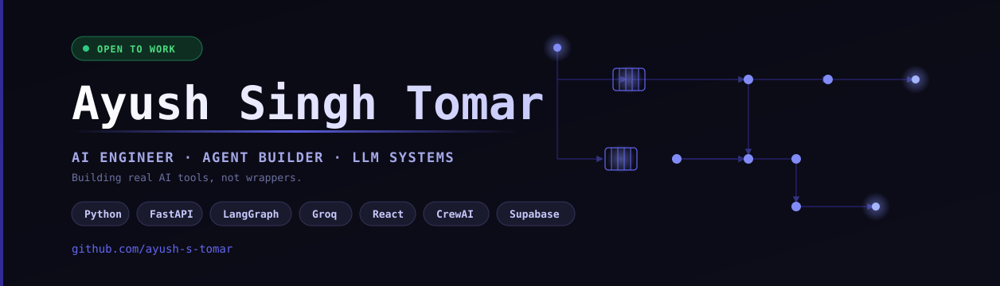
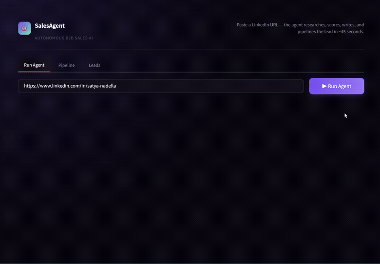
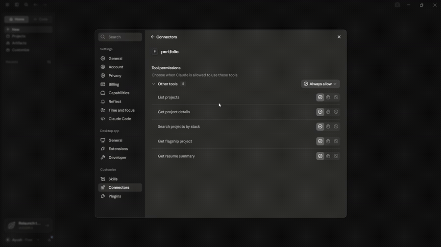
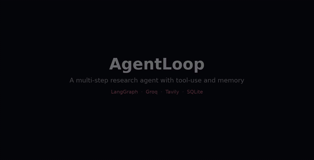
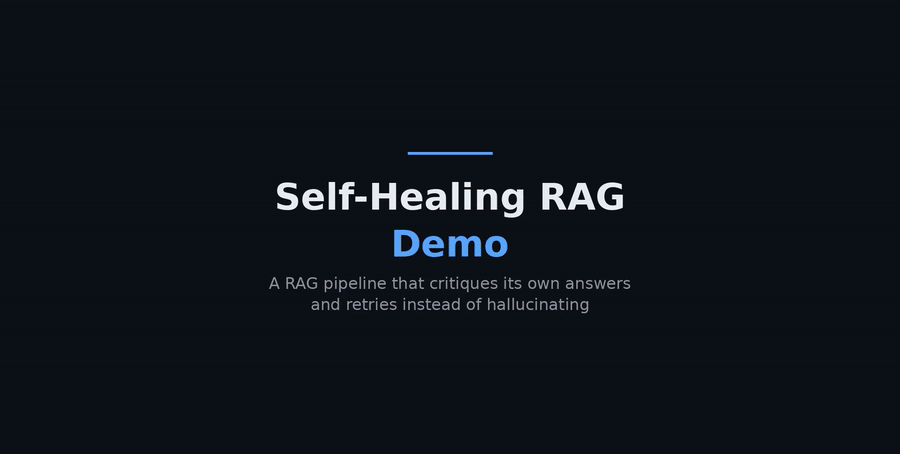

 

---

## 👨‍💻 About Me

Final-year B.Tech IT student at MITS Gwalior, building deployed AI systems that go beyond API wrappers — multi-agent pipelines, RAG systems, a protocol-compliant MCP server, and a LoRA fine-tuned model published on Hugging Face.

- 🎓 B.Tech IT, MITS Gwalior (Final Year) · CGPA 7.87
- 🔭 Specialising in multi-agent systems, RAG pipelines & LLM infrastructure
- 🚀 Live, deployed systems — not localhost demos: agents, RAG pipelines, a fine-tuned model on Hugging Face, and a protocol-compliant MCP server
- 🏆 NPTEL (IIT Kanpur) Elite + Top 5%, Cloud Computing & Distributed Systems
<<<<<<< HEAD
- 💼 Freelance AI Developer (Upwork) · 5.0/5.0 client rating · Open to full-time AI Developer roles
=======
- 💼 Freelance AI Developer on Upwork · Open to full-time AI Developer roles
>>>>>>> 22f1a11 (Polish profile README and banner: fix truncated CTA, remove dead redeploy links, trim redundant messaging)

---

## 🤖 Projects

**[SalesAgent](https://github.com/ayush-s-tomar/salesagent)** — [Live Demo](https://salesagent-ai.streamlit.app/) | [📝 Writeup](https://dev.to/ayushsinghtomar/i-got-tired-of-writing-cold-emails-so-i-built-an-ai-agent-to-do-it-for-me-2m4h)
Autonomous B2B sales agent. Paste a LinkedIn URL — it researches the lead, scores them with ML (84/100), and drafts a hyper-personalized cold email referencing real company events. In 45 seconds.
Built an eval harness that caught two production bugs before they shipped — uniform lead scores and missing sender identity in generated emails.
`LangGraph` `FastAPI` `React` `scikit-learn` `Groq` `Tavily`

**[Portfolio MCP Server](https://github.com/ayush-s-tomar/portfolio-mcp-server)** — Local only (Claude Desktop)
A working MCP server exposing tools for project search, stack filtering, and resume summary — so any MCP client queries this portfolio as live structured data instead of a static page. Implements real client-side permission gating and tool-call routing — a protocol-compliant server, not a wrapper.
`Python` `MCP (FastMCP SDK)` `stdio transport` `Claude Desktop`

**[LLM Cost Router](https://github.com/ayush-s-tomar/llm-cost-router)** — [Live Demo](https://llm-cost-router.streamlit.app/)
A heuristic query-complexity classifier that routes requests between a cheap and a far more expensive Groq model, cutting cost significantly on simple queries with no quality loss on complex ones. Includes a live dashboard tracking real spend vs. a same-model baseline.
`FastAPI` `Groq (Llama 3.1 8B / 3.3 70B)` `Streamlit`

**[AgentLoop](https://github.com/ayush-s-tomar/agentloop)** — [Live Demo](https://agentloop.streamlit.app/)
Not a chatbot. A multi-step research agent that breaks your question into sub-questions, searches the live web, reflects on gaps, loops back, and delivers a fully cited report.
Two-tier memory — short-term run state plus long-term SQLite recall — with live trace events streamed to the UI as it thinks.
`FastAPI` `LangGraph` `Groq` `SQLite`

---

<b>▶ More projects</b> (RAG systems, voice AI, automation agents & more)

 

**[Self-Healing RAG](https://github.com/ayush-s-tomar/self-healing-rag)** — [Live Demo](https://rag-critic-loop.streamlit.app/)
RAG pipeline that critiques its own answers — if a response isn't grounded in the retrieved documents, it reformulates the query and retries instead of hallucinating.
`LangGraph` `Chroma` `Groq` `Streamlit`

**[AI Interview Coach](https://github.com/ayush-s-tomar/ai-interview-coach)** — [Live Demo](https://mockinterview-ai.streamlit.app/)
Real-time voice interview simulator — answers scored on relevance, clarity, technical accuracy, and confidence via Groq LLaMA 3.3, with a downloadable PDF report.
`Streamlit` `Faster-Whisper` `Groq` `PDF Generation`

**[AskMyDocs](https://github.com/ayush-s-tomar/intellect-docs-ai)** — [Live Demo](https://intellect-docs-ai.vercel.app/)
RAG pipeline that answers questions over 50-page PDFs in under 3 seconds — with source citations, cosine similarity scores, and an automated eval + CI pipeline.
LLM-as-judge scoring plus keyword validation in CI catches retrieval regressions before they reach deploy.
`Next.js` `Supabase` `pgvector` `Cohere`

**[Agentic RAG Research Assistant](https://github.com/ayush-s-tomar/agentic-rag-research-assistant)** — [Live Demo](https://agentic-rag-groq.streamlit.app/) | [API Docs](https://agentic-rag-research-assistant-jjch.onrender.com/docs)
Agentic RAG system with LangGraph tool-routing: retrieves grounded answers from uploaded PDFs via a Chroma vector store, refuses out-of-scope questions instead of guessing, and routes queries between a cheap and large model based on complexity.
`LangGraph` `FastAPI` `Streamlit` `Chroma` `Groq`

**[AI Data Analyst Agent](https://github.com/ayush-s-tomar/ai-data-analyst)** — [Live Demo](https://askthedata-ai.streamlit.app/)
Upload CSV, Excel, PDF, Parquet, XML, SQLite, ODS, or Feather files — ask questions in plain English, get instant charts and insights.
`FastAPI` `React` `Groq` `pandas`

**[LoRA Fine-Tuned Resume Screener](https://github.com/ayush-s-tomar/resume-screener-lora)** — [Try it](https://resume-screener-lora.streamlit.app/) | [Hugging Face](https://huggingface.co/Kus-hal/resume-screener-lora)
Fine-tuned a LoRA adapter on Qwen2.5-0.5B for structured JSON resume-fit verdicts — outperforms prompting alone on output consistency. Published for reproducible, framework-agnostic inference.
r=16, just 0.44% of parameters trained; validation loss tracked training loss across 3 epochs with no divergence — no overfitting.
`Qwen2.5-0.5B` `LoRA (PEFT)` `PyTorch` `Hugging Face Transformers`

**[Email Agent](https://github.com/ayush-s-tomar/Email-agent)** — [Live Demo](https://ai-inbox-agent.streamlit.app/)
AI Gmail agent that classifies emails and drafts context-aware replies you can approve or edit before sending.
`IMAP` `SMTP` `Groq` `LLaMA 3.3` `Streamlit`

**[ARIA – Voice AI Assistant](https://github.com/ayush-s-tomar/aria-voice-assistant)** — [Live Demo](https://aria-bot.streamlit.app/)
Speech-to-speech AI assistant with 99-language support and conversation memory. Speak in any language — ARIA transcribes, thinks, and talks back.
`FastAPI` `Faster-Whisper` `Groq` `LLaMA` `gTTS`

**[ResumeIQ](https://github.com/ayush-s-tomar/ResumeIQ)** — [Live Demo](https://resume-iq-screener.streamlit.app/)
AI resume screener that scores ATS compatibility, identifies gaps, and exports detailed PDF reports.
`Python` `Flask` `Groq`

**[North Star Support Chatbot](https://github.com/ayush-s-tomar/northstar-chatbot)** — Local only
AI-powered customer support chatbot for a North Star outdoor gear store, with full conversation handling and escalation logic.
`React` `FastAPI` `Groq` `LLaMA`

<b>▶ In progress / archived</b>

 

**[StartupScope](https://github.com/ayush-s-tomar/startupscope)** — 🚧 *Demo temporarily offline, redeploying*
Multi-agent CrewAI crew — Researcher, Analyst, and Writer agents collaborate to search the web and generate structured startup intelligence reports.
`CrewAI` `Groq` `Streamlit`

**[JobHunt](https://github.com/ayush-s-tomar/jobhunt)** — 🚧 *Demo temporarily offline, redeploying*
AI-powered Telegram job aggregator — scores every post and auto-applies via email or form-fill. Watches job channels 24/7 so you don't have to.
`FastAPI` `PostgreSQL` `Groq`

**[n8n Email → Slack](https://github.com/ayush-s-tomar/n8n-email-slack)** — *Archived, hosting suspended*
No-code AI automation pipeline: fetches unread Gmail → summarizes with Groq LLaMA → detects priority → pushes digest to Slack.
`n8n` `Groq` `Gmail` `Slack`

---

<<<<<<< HEAD
## 💼 Freelance Experience

**Freelance AI Developer** — Self-Employed, Remote · *May 2026 – Present*
Design and ship deployed AI systems end-to-end for clients — agentic workflows, RAG pipelines, LLM tooling.

**AI Chatbot Developer — Upwork Talent Accelerator** · *Jun 2026*
Delivered a chatbot contract end-to-end in 3 days. Client rated **5.0/5.0**.

---

## 🏆 Achievements

- **Freelance client rating** — 5.0/5.0 on Upwork, 3-day turnaround on a full chatbot contract.
- **Cloud Computing and Distributed Systems** — NPTEL (IIT Kanpur), Elite + Top 5% Topper, 90% (Jan–Mar 2026).
=======
## 💼 Experience & Achievements

**Freelance AI Developer** — Self-Employed, Remote · *May 2026 – Present*
Design and ship deployed AI systems end-to-end for clients — agentic workflows, RAG pipelines, LLM tooling.

**AI Chatbot Developer — Upwork Talent Accelerator** · *Jun 2026*
Delivered a chatbot contract end-to-end in 3 days. Client rated **5.0/5.0**.

**Cloud Computing and Distributed Systems** — NPTEL (IIT Kanpur)
Elite + Top 5% Topper, 90% (Jan–Mar 2026).
>>>>>>> 22f1a11 (Polish profile README and banner: fix truncated CTA, remove dead redeploy links, trim redundant messaging)

---

## 🛠 Stack

`Python` `JavaScript/TypeScript` `FastAPI` `Flask` `LangGraph` `CrewAI` `MCP` `Groq` `LLaMA 3.3` `LoRA/PEFT` `PyTorch` `Whisper` `React` `Next.js` `Supabase` `PostgreSQL` `Chroma` `Docker` `Git` `Streamlit` `Vercel`

---

## 📊 GitHub Stats

---

## 🐍 Contribution Snake

---

## 📬 Let's Build Something

<<<<<<< HEAD
Open to AI Developer roles and freelance contracts — reach out on [LinkedIn](https://linkedin.com/in/ayushsinghtomar), read more on [Dev.to](https://dev.to/ayushsinghtomar), or [hire me on Upwork](https://www.upwork.com/freelancers/ayushtomar).
=======
Have a problem worth an agent, a RAG pipeline, or an LLM integration? Reach out on [LinkedIn](https://linkedin.com/in/ayushsinghtomar), read the build logs on [Dev.to](https://dev.to/ayushsinghtomar), or [start a contract on Upwork](https://www.upwork.com/freelancers/ayushtomar).
>>>>>>> 22f1a11 (Polish profile README and banner: fix truncated CTA, remove dead redeploy links, trim redundant messaging)
